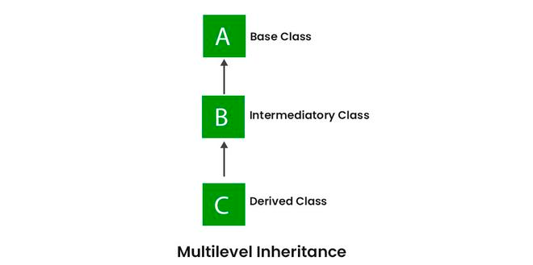
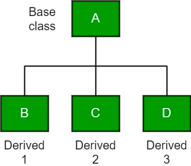
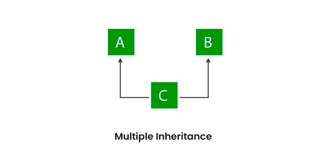

# Inheritance in Java

Java, Inheritance is an important pillar of OOP(Object-Oriented Programming). It is the mechanism in Java by which one class is allowed to inherit the features(fields and methods) of another class. In Java, Inheritance means creating new classes based on existing ones. A class that inherits from another class can reuse the methods and fields of that class. In addition, you can add new fields and methods to your current class as well.  

## 1. Why Do We Need Java Inheritance?

1. Code Reusability: The code written in the Superclass is common to all subclasses. Child classes can directly use the parent class code.
2. Method Overriding: Method Overriding is achievable only through Inheritance. It is one of the ways by which Java achieves Run Time Polymorphism.
3. Abstraction: The concept of abstract where we do not have to provide all details is achieved through inheritance. Abstraction only shows the functionality to the user.

## 2. Important Terminologies Used in Java Inheritance

##### 1. Class:

Class is a set of objects which shares common characteristics/ behavior and common properties/ attributes. Class is not a real-world entity. It is just a template or blueprint or prototype from which objects are created.

##### 2. Super Class/Parent Class: 

The class whose features are inherited is known as a superclass(or a base class or a parent class).

##### 3. Sub Class/Child Class: 

The class that inherits the other class is known as a subclass(or a derived class, extended class, or child class). The subclass can add its own fields and methods in addition to the superclass fields and methods.

##### 4. Reusability: 

Inheritance supports the concept of “reusability”, i.e. when we want to create a new class and there is already a class that includes some of the code that we want, we can derive our new class from the existing class. By doing this, we are reusing the fields and methods of the existing class.

## 3.Java Inheritance Types

Below are the different types of inheritance which are supported by Java.

1. Single Inheritance
2. Multilevel Inheritance
3. Hierarchical Inheritance
4. Multiple Inheritance
5. Hybrid Inheritance

##### 1. Single Inheritance

In single inheritance, subclasses inherit the features of one superclass. In the image below, class A serves as a base class for the derived class B.

##### 2. Multilevel Inheritance

In Multilevel Inheritance, a derived class will be inheriting a base class, and as well as the derived class also acts as the base class for other classes. In the below image, class A serves as a base class for the derived class B, which in turn serves as a base class for the derived class C. In Java, a class cannot directly access the grandparent’s members.

##### 3. Hierarchical Inheritance

In Hierarchical Inheritance, one class serves as a superclass (base class) for more than one subclass. In the below image, class A serves as a base class for the derived classes B, C, and D.

##### 4. Multiple Inheritance (Through Interfaces)

In Multiple inheritances, one class can have more than one superclass and inherit features from all parent classes. Please note that Java does not support multiple inheritances with classes. In Java, we can achieve multiple inheritances only through Interfaces. In the image below, Class C is derived from interfaces A and B.

##### 5. Hybrid Inheritance

It is a mix of two or more of the above types of inheritance. Since Java doesn’t support multiple inheritances with classes, hybrid inheritance involving multiple inheritance is also not possible with classes. In Java, we can achieve hybrid inheritance only through Interfaces if we want to involve multiple inheritance to implement Hybrid inheritance.
However, it is important to note that Hybrid inheritance does not necessarily require the use of Multiple Inheritance exclusively. It can be achieved through a combination of Multilevel Inheritance and Hierarchical Inheritance with classes, Hierarchical and Single Inheritance with classes. Therefore, it is indeed possible to implement Hybrid inheritance using classes alone, without relying on multiple inheritance type. 

## 4. What Can Be Done in a Subclass?

In sub-classes we can inherit members as is, replace them, hide them, or supplement them with new members:

1. The inherited fields can be used directly, just like any other fields.
2. We can declare new fields in the subclass that are not in the superclass.
3. The inherited methods can be used directly as they are.
4. We can write a new instance method in the subclass that has the same signature as the one in the superclass, thus overriding it (as in the example above, toString() method is overridden).
5. We can write a new static method in the subclass that has the same signature as the one in the superclass, thus hiding it.
6. We can declare new methods in the subclass that are not in the superclass.
7. We can write a subclass constructor that invokes the constructor of the superclass, either implicitly or by using the keyword super.